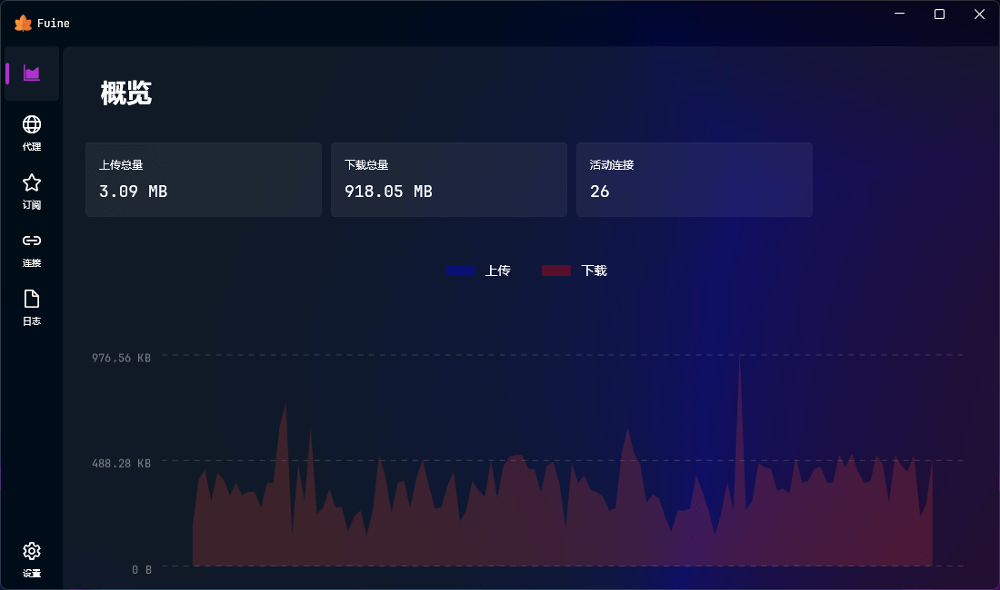
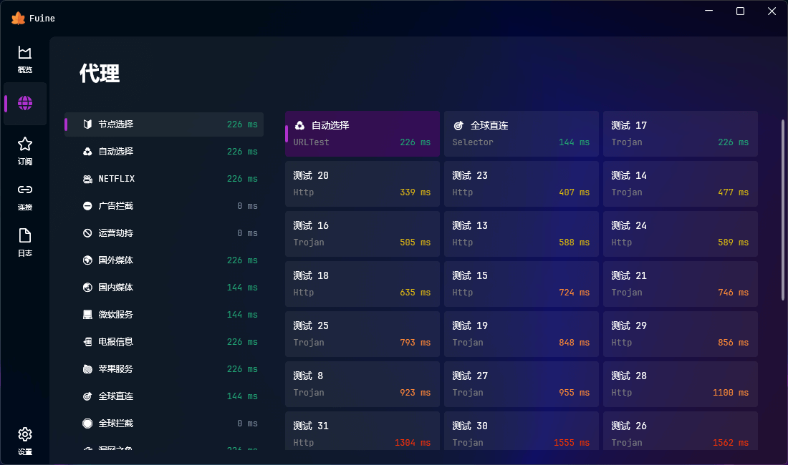
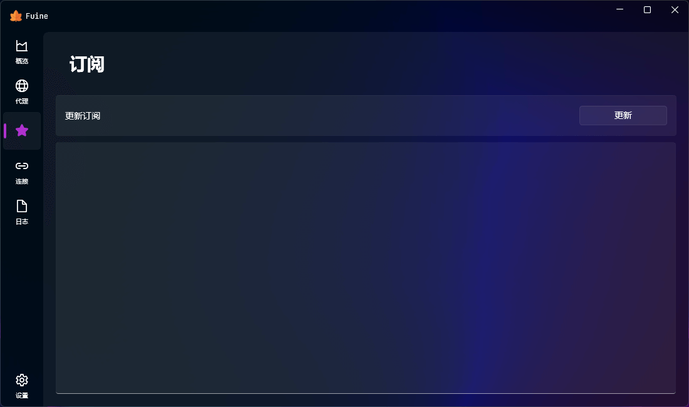
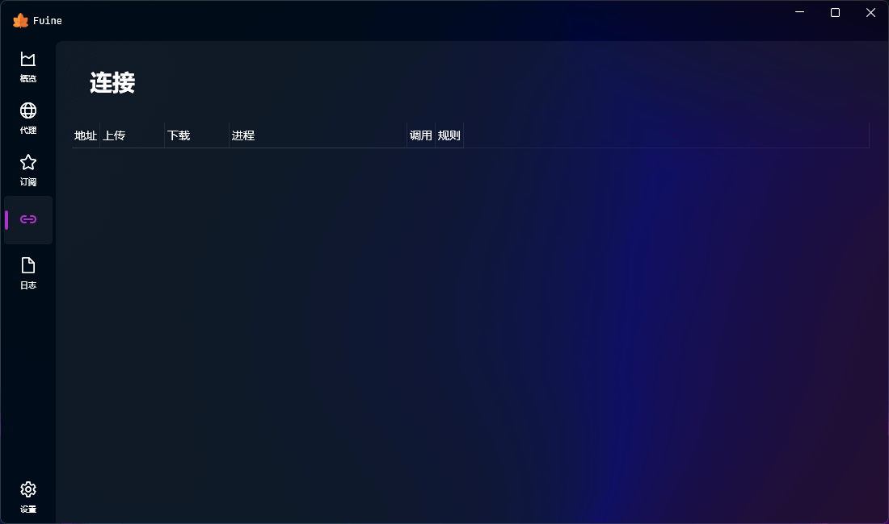
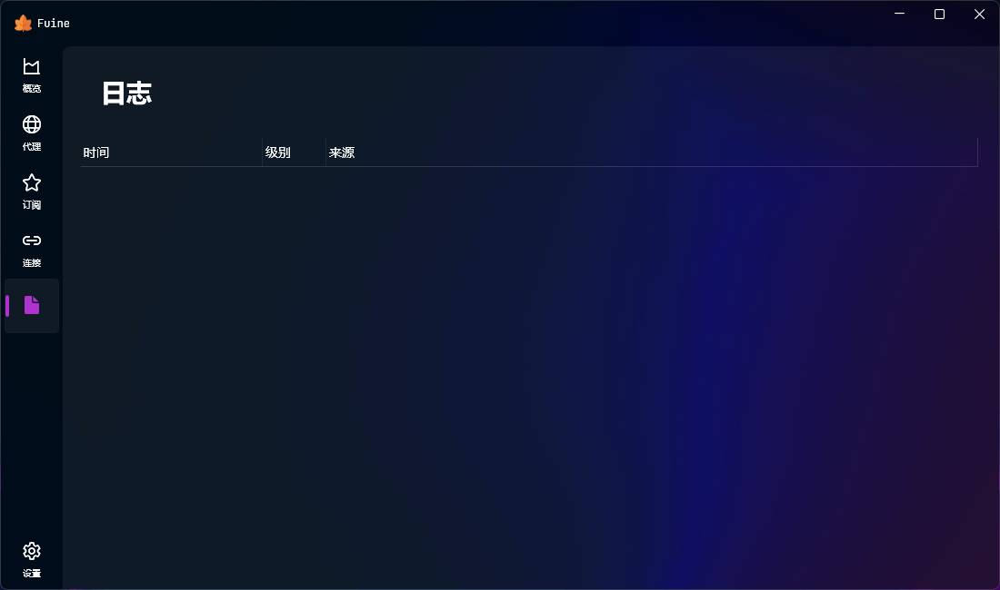
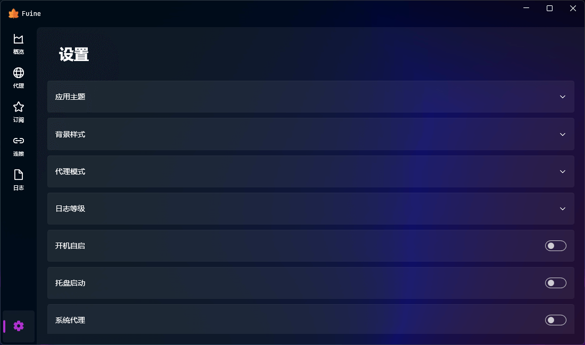

  

# Fuine

一份简约的 clash 客户端。

# 依赖环境

# 功能介绍

添加订阅并点击更新，然后在设置中打开系统代理即可。如果你觉得功能太简单了，那么请直接编辑它们配置文件进行修改。

# 预览图片

# 相关项目

- [clash](https://github.com/dreamacro/clash)
- [clasharp](https://github.com/moonheart/clasharp)
- [clashcat](https://github.com/slimenull/clashcat)
- [meta](https://github.com/metacubex/clash.meta)
- [subconverter](https://github.com/tindy2013/subconverter)
- [wpfui](https://github.com/lepoco/wpfui)
- [yacd](https://github.com/haishanh/yacd)

# 许可证

[MIT](https://github.com/chzuka/fuine/blob/main/LICENSE)